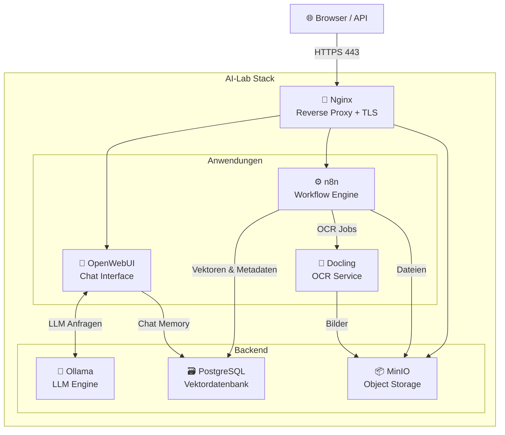
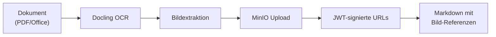
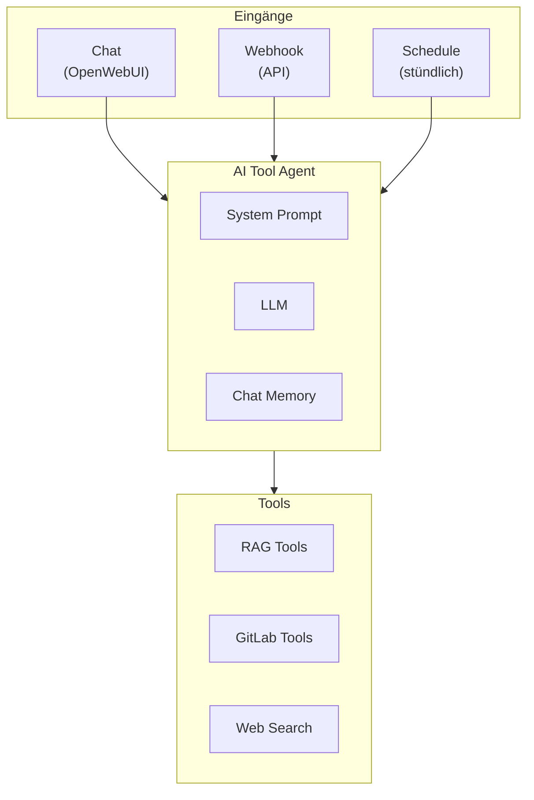
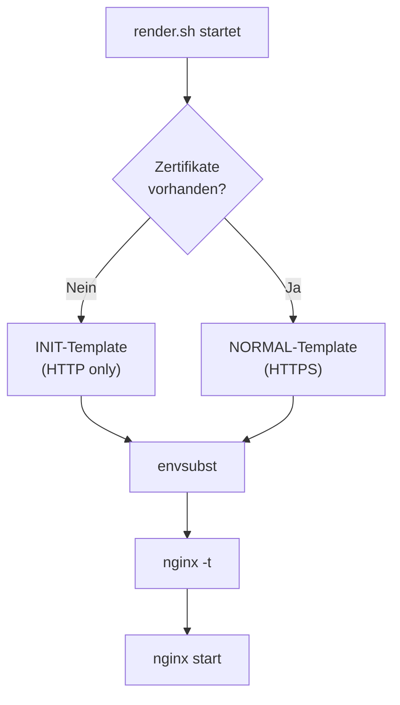
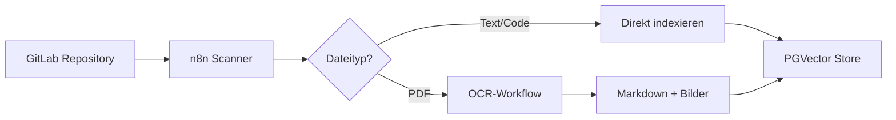
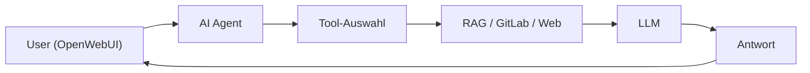

# AI-Lab

Ein modularer **KI- und Automatisierungs-Stack** für Dokumentenverarbeitung, Workflow-Automatisierung und KI-gestützte Softwareentwicklung.

---

## Übersicht

AI-Lab ist eine containerisierte Plattform, die folgende Kernfunktionen vereint:

- **LLM-Chat-Interface** (OpenWebUI + Ollama)
- **Workflow-Automatisierung** (n8n)
- **Dokumenten-OCR** mit Bildextraktion (Docling)
- **RAG-basierte Wissensabfrage** (PGVector)
- **S3-kompatibler Storage** (MinIO)
- **KI-Agent für Softwareentwicklung** mit GitLab-Integration

---

## Architektur



---

## Komponenten

### Dienste

| Dienst | Image | Port | Funktion |
|--------|-------|------|----------|
| **OpenWebUI** | `ghcr.io/open-webui/open-webui:main` | 8080 | LLM-Chat-Interface |
| **Ollama** | `ollama/ollama` | 11434 | LLM-Engine für lokale Modelle |
| **n8n** | `docker.n8n.io/n8nio/n8n` | 5678 | Workflow-Automatisierung |
| **Docling** | `ghcr.io/docling-project/docling-serve:main` | 5001 | OCR & Dokumentenanalyse |
| **PostgreSQL** | `ankane/pgvector` | 5432 | Datenbank mit Vektorsuche |
| **MinIO** | `quay.io/minio/aistor/minio` | 9000 | S3-kompatibler Object Storage |
| **Nginx** | `openresty/openresty:alpine-fat` | 80/443 | Reverse Proxy mit Lua-Support |
| **Certbot** | `certbot/certbot` | - | TLS-Zertifikatsverwaltung |

### Netzwerk

- Internes Docker-Netzwerk: `ai-lab`
- Subnetz: `172.30.10.0/24`
- Alle Dienste kommunizieren intern über Docker-DNS

---

## Workflows

### 1) OCR-Workflow

Automatisierte Dokumentenverarbeitung mit Bildextraktion und S3-Upload.



**Funktionen:**
- Asynchrone OCR-Verarbeitung via Docling
- Automatische Bildklassifizierung und -beschreibung (Ollama llava:7b)
- Upload extrahierter Bilder nach MinIO
- Generierung JWT-signierter URLs für geschützten Bildzugriff
- Ausgabe als Markdown mit eingebetteten Bild-URLs

### 2) GitLab AI Agent

KI-gestützter Entwicklungsassistent mit vollständiger GitLab-Integration.



**Verfügbare Tools:**

| Kategorie | Tools |
|-----------|-------|
| **RAG** | Postgres PGVector Store, List Documents, Get File Contents |
| **GitLab** | List Projects, List Branches, Get File, Create Branch, Update File, Create File, List Commits, List Issues, Create Issue, Create MR, List Users, List Folders |
| **Web** | SerpAPI Search |

**Eigenschaften:**
- Strikte Source-of-Truth-Hierarchie: GitLab → RAG → Web → Eigenwissen
- Automatische RAG-Synchronisierung (stündlich)
- Bestätigungspflicht für schreibende GitLab-Operationen
- Antworten immer auf Deutsch

---

## Nginx Template-System

Dynamische Konfigurationsgenerierung mit drei Modi:

| Template | Verwendung | Besonderheit |
|----------|------------|--------------|
| `sites.init.conf.template` | Erststart ohne Zertifikate | Nur HTTP, ACME-Challenge |
| `sites.conf.template` | Normalbetrieb | HTTPS, Reverse Proxy |
| `sites.secured.conf.template` | Produktiv mit Zugriffskontrolle | JWT-Validierung, IP-Whitelisting |

### Automatische Template-Auswahl



### Umgebungsvariablen

| Variable | Beispiel | Verwendung |
|----------|----------|------------|
| `HOST` | `ai-lab` | Subdomain-Prefix |
| `DOMAIN` | `raspilab.de` | Basis-Domain |
| `UPSTREAM_OPENWEBUI` | `openwebui:8080` | Backend-Adresse |
| `UPSTREAM_N8N` | `n8n:5678` | Backend-Adresse |
| `UPSTREAM_S3` | `minio:9000` | Backend-Adresse |

---

## Projektstruktur

```
ai-lab/
├── compose.yml                 # Docker Compose Stack-Definition
├── create-env.sh               # Interaktiver .env-Generator
├── .gitignore
│
├── nginx/
│   ├── render.sh               # Template-Renderer mit Lua-Setup
│   ├── snippets/
│   │   └── proxy-common.conf   # Gemeinsame Proxy-Einstellungen
│   └── templates/
│       ├── sites.init.conf.template     # Init-Modus (HTTP)
│       ├── sites.conf.template          # Standard (HTTPS)
│       └── sites.secured.conf.template  # Secured (HTTPS + JWT)
│
├── workflows/
│   ├── OCR_Workflow.json       # Docling OCR Pipeline
│   └── GitLab_Ai_Agent.json    # KI-Entwicklungsassistent
│
└── functions/
    └── function-n8n_pipe.json  # n8n Funktionsmodul
```

---

## Sicherheit

### TLS/SSL
- Automatische Zertifikatserneuerung via Certbot (alle 12h)
- Let's Encrypt Zertifikate
- HTTP → HTTPS Redirect

### Zugriffskontrolle (Secured Mode)
- MinIO Root-Pfad: Nur internes Docker-Netzwerk (`172.30.10.0/24`)
- S3-Dateizugriff via `/n8n/`-Pfad: JWT-Validierung erforderlich

### JWT-Schema
```json
{
  "bucket": "n8n",
  "object": "<filename>",
  "iss": "n8n-fileservice",
  "exp": "<timestamp>"
}
```

### Credentials
- `.env`-Datei mit `chmod 600` (nur Owner lesbar)
- Passwort-Generierung via `create-env.sh` mit `/dev/urandom`

---

## JWT-Token für Bild-URLs (Experimentell)

> ⚠️ **Hinweis:** Dieses Feature ist experimentell und funktioniert noch nicht vollständig.

### Beschreibung

Im Secured Mode werden Bild-URLs aus dem OCR-Workflow mit JWT-Token signiert. Dies verhindert unbefugten Zugriff auf extrahierte Bilder im MinIO-Storage.

### Bekannte Einschränkungen

Das KI-Modell liest die vollständigen URLs mit JWT-Token nicht immer korrekt aus dem RAG-System aus. Dies führt dazu, dass Bild-Links in Chat-Antworten teilweise nicht funktionieren. Die Ursache liegt vermutlich im Embedding-Prozess.

### Aktivierung

Siehe [INSTALL.md](INSTALL.md#jwt-token-für-bild-urls-aktivieren-experimentell) für die vollständige Anleitung.

---

## Konfiguration

### Umgebungsvariablen (.env)

| Variable | Beschreibung | Beispiel |
|----------|--------------|----------|
| `DOMAIN_NAME` | Top-Level Domain | `raspilab.de` |
| `SUBDOMAIN` | Subdomain | `ai-lab` |
| `HOST` | Stack-Name | `ai-lab` |
| `GENERIC_TIMEZONE` | Zeitzone | `Europe/Berlin` |
| `SSL_EMAIL` | E-Mail für Let's Encrypt | `admin@ai-lab.raspilab.de` |
| `SHARED_FOLDER` | Austauschordner n8n ↔ Docling | `shared` |
| `IMAGE_FOLDER` | Bildordner | `images` |
| `MINIO_ROOT_USER` | MinIO Admin-User | - |
| `MINIO_ROOT_PASSWORD` | MinIO Admin-Passwort | - |
| `POSTGRES_USER` | Datenbank-User | - |
| `POSTGRES_PASSWORD` | Datenbank-Passwort | - |
| `POSTGRES_DB` | Datenbankname | `postgres` |

### Interaktive Konfiguration

```bash
./create-env.sh
```

Das Script führt durch alle Konfigurationswerte und bietet:
- Sinnvolle Defaults
- Sichere Passwort-Generierung (`RANDOM`)
- Bestätigung vor dem Schreiben
- Automatische Dateiberechtigungen

---

## URLs

Nach erfolgreicher Installation sind folgende Endpunkte verfügbar:

| Dienst | URL |
|--------|-----|
| **OpenWebUI** | `https://<HOST>.<DOMAIN>/` |
| **n8n** | `https://n8n.<HOST>.<DOMAIN>/` |
| **MinIO Console** | `https://s3.<HOST>.<DOMAIN>/` |

---

## Datenfluss

### RAG-Indexierung



### Chat-Anfrage



---

## Technologie-Stack

| Kategorie | Technologien |
|-----------|--------------|
| **Container** | Docker, Docker Compose |
| **Reverse Proxy** | OpenResty (Nginx + Lua) |
| **LLM** | Ollama, Azure OpenAI |
| **Workflow** | n8n |
| **OCR** | Docling |
| **Datenbank** | PostgreSQL + PGVector |
| **Storage** | MinIO (S3-kompatibel) |
| **TLS** | Let's Encrypt, Certbot |
| **Authentifizierung** | JWT (RS256) |

---

## Weiterführende Dokumentation

- [n8n Dokumentation](https://docs.n8n.io/)
- [Docling Dokumentation](https://github.com/docling-project/docling)
- [OpenWebUI Dokumentation](https://docs.openwebui.com/)
